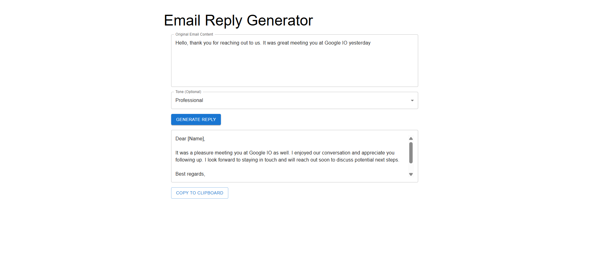
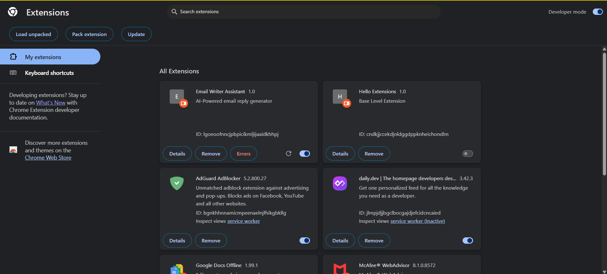
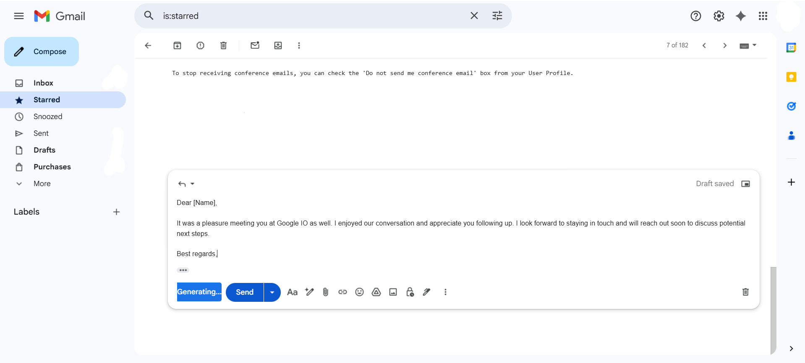

# ✉️ Email Writer Assistant — AI-Powered Gmail Reply Generator

> **Production-grade AI system that integrates directly into Gmail to generate high-quality email replies using Large Language Models (LLMs).**

This project demonstrates **end-to-end system design**, secure AI integration, browser extension engineering, and modern full‑stack development practices — aligned with **Google-level engineering standards**.

---

## 🌟 Why This Project Stands Out

✔ Real-world problem solving (email productivity)
✔ Secure LLM integration (API key protection)
✔ Chrome Extension + Web App + Backend system
✔ Clean architecture & scalable design
✔ Production-ready deployment strategy

---

## 🚀 Key Features

* ✨ One-click **AI Reply** button inside Gmail compose window
* 🎯 Tone-aware responses (Professional, Casual, Friendly)
* 🧠 Uses **Google Gemini API** for high-quality responses
* 🔐 Backend-secured API calls (no API keys exposed)
* ⚡ Fast, responsive UI with Material UI
* 🧩 DOM MutationObserver-based Gmail integration

---

## 🛠 Tech Stack

### Frontend (Web App)

* React (Vite)
* Material UI (MUI)
* Axios

### Backend (AI Gateway)

* Spring Boot (Java)
* RESTful APIs
* Google Gemini API
* Environment-based configuration

### Browser Extension

* Chrome Extension (Manifest v3)
* Content Scripts
* MutationObserver
* Gmail DOM integration

---

## 🧠 System Architecture

```
User (Browser)
   │
   ├── Gmail Extension ──▶ Spring Boot API ──▶ Gemini API
   │                          ▲
   └── React Web App ─────────┘
```

**Why this design?**

* Prevents API key leakage
* Enables request validation & logging
* Allows future scaling (rate limiting, auth, caching)

---

## 📂 Monorepo Structure

```
email-writer-assistant/
│
├── backend/          # Spring Boot – AI orchestration layer
│   ├── src/
│   ├── pom.xml
│   └── application.properties
│
├── frontend/         # React + MUI Web Application
│   ├── src/
│   ├── package.json
│   └── vite.config.js
│
├── extension/        # Chrome Gmail Extension
│   ├── manifest.json
│   ├── content.js
│   └── content.css
│
├── screenshots/
├── README.md
└── .gitignore
```

---

## 🖼 Screenshots

### 🌐 Web Application

*Add screenshots showing email input, tone selection, and generated reply.*



---

### 🧩 Chrome Extension

*Add screenshots of the AI Reply button injected into Gmail.*



---

### 📧 Gmail Integration

*Add screenshots of AI-generated reply inside Gmail compose box.*



---

## 🔐 Environment Variable Management

### Backend (Spring Boot)

```env
GEMINI_API_KEY=your_api_key_here
```

Injected via:

* Local: `.env` / OS variables
* Production: Render environment settings

✔ Ensures **zero API key exposure**

---

### Frontend (React)

```env
VITE_API_BASE_URL=https://your-backend-url
```

---

## ▶️ Running Locally

### Backend

```bash
cd backend
./mvnw spring-boot:run
```

### Frontend

```bash
cd frontend
npm install
npm run dev
```

### Chrome Extension

1. Open `chrome://extensions`
2. Enable **Developer Mode**
3. Click **Load unpacked**
4. Select the `extension/` folder
5. Open Gmail → Compose → Click **AI Reply**

---

## 🌍 Deployment Strategy

| Layer     | Platform | Reason                             |
| --------- | -------- | ---------------------------------- |
| Frontend  | Vercel   | Fast global CDN                    |
| Backend   | Render   | Secure env variables & JVM support |
| Extension | Chrome   | Native Gmail integration           |

---

## 📈 Scalability & Improvements

* ⏱ Rate limiting & request quotas
* 🧾 Request logging & analytics
* 🧠 Context-aware multi-email threads
* 🌍 Multi-language reply generation
* 🔐 OAuth-based user authentication

---

## 👨‍💻 Author

**Om Bhosale**
CSE | Java Full Stack & DevOps Engineer


---

## ⭐ Resume Impact

This project demonstrates:

* Full-stack system ownership
* Secure AI integration
* Browser internals & DOM manipulation
* Production deployment practices

⭐ **Strong fit for Google / Product-based company interviews**
